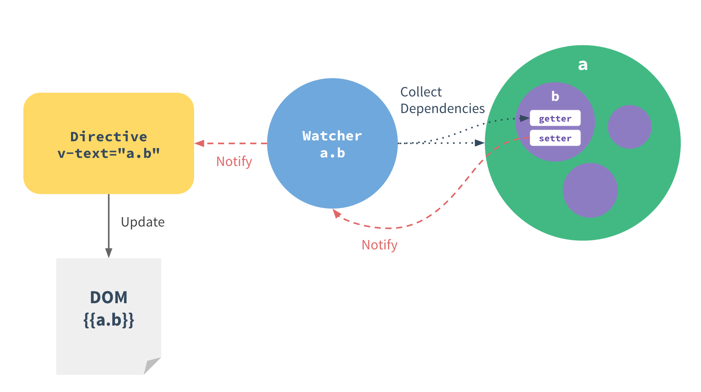

# Introduction to Vue.js data()

One of Vue.js’ most distinct features is the unobtrusive reactive system - models are just plain JavaScript objects, modify it and the view updates. It makes state management very simple and intuitive, but it’s also important to understand how it works to avoid some common gotchas. In this section, we are going to dig into some of the lower-level details of Vue.js’ data flow and reactivity system.


## What is data

Data is the memory of each component. This is where you would store data (hence the name), and any other variables you want to track.

The data property value is an anonymous function which is returning object.Every property inside that object is added to the Vue reactivity system so that if we change that property value then vuejs re-renders the dom with the updated data.


## How Changes Are Tracked

When you pass a plain JavaScript object to a Vue instance as its data option, Vue.js will walk through all of its properties and convert them to getter/setters using [Object.defineProperty](https://developer.mozilla.org/en-US/docs/Web/JavaScript/Reference/Global_Objects/Object/defineProperty). This is an ES5-only and un-shimmable feature, which is why Vue.js doesn’t support IE8 and below.

The getter/setters are invisible to the user, but under the hood they enable Vue.js to perform dependency-tracking and change-notification when properties are accessed or modified. One caveat is that browser consoles format getter/setters differently when converted data objects are logged.

For every directive / data binding in the template, there will be a corresponding **watcher object**, which records any properties “touched” during its evaluation as dependencies. Later on when a dependency’s setter is called, it triggers the watcher to re-evaluate, and in turn causes its associated directive to perform DOM updates.



## Change Detection Caveats

Due to the limitation of ES5, Vue.js **cannot detect property addition or deletion**. Since Vue.js performs the getter/setter conversion process during instance initialization, a property must be present in the data object in order for Vue.js to convert it and make it reactive.

### [](https://codesandbox.io/s/gifted-pike-3mjx2?file=/src/components/ExampleOfIncorrectDefineData.vue)

For example:

```vue
<script>
    export default {
        data() {
            return {
                a: 1 // a is a reactive
            }
        },
        created() {
            this.b = 2 // b is NOT reactive
        }
    }
</script>
```

However, there are ways to add a property and make it reactive after an instance has been created.
For Vue instances, you can use the $set(path, value) instance method:
```vue
<script>
    export default {
        data() {
            return {}
        },
        created() {
            this.$set('b', 2) // b are now reactive
        }
    }
</script>
```

## Initialize Your Data

Although Vue.js provides the API to dynamically add reactive properties on the fly, it is recommended to declare all reactive properties upfront in the data option.

Instead of this:

```vue
<script>
    export default {
        data() {
            return {}
        },
        created() {
            this.$set('b', 2) // b are now reactive
        }
    }
</script>
```

Prefer this:

```vue
<script>
    export default {
        data() {
            return {
              b: 2
            }
        },
    }
</script>
```
There are two reasons behind this pattern:

1. The data object is like the schema for your component’s state. Declaring all reactive properties upfront makes the component code easier to understand and reason about.

2. Adding a top level reactive property on a Vue instance will force all the watchers in its scope to re-evaluate, because it didn’t exist before and no watcher could have tracked it as a dependency. The performance is usually acceptable (essentially the same as Angular’s dirty checking), but can be avoided when you initialize the data properly.
